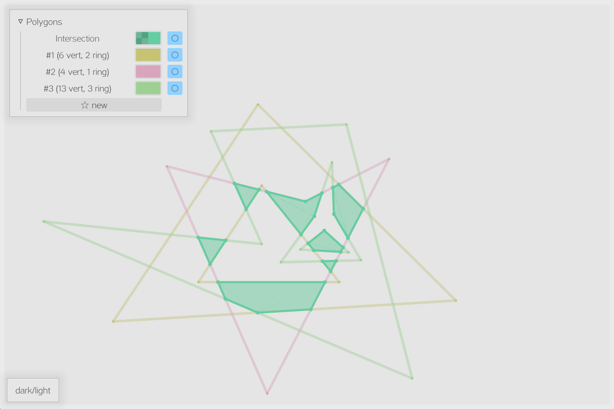
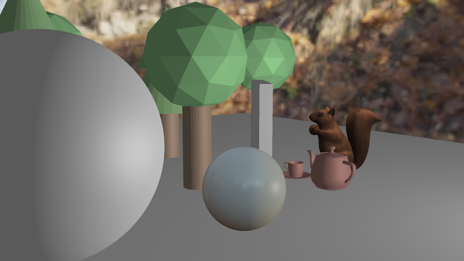
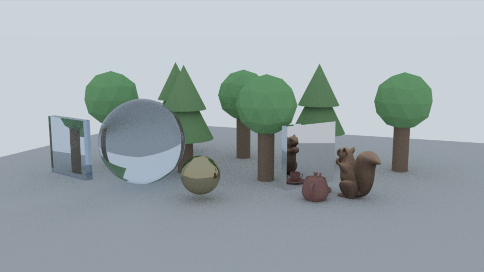
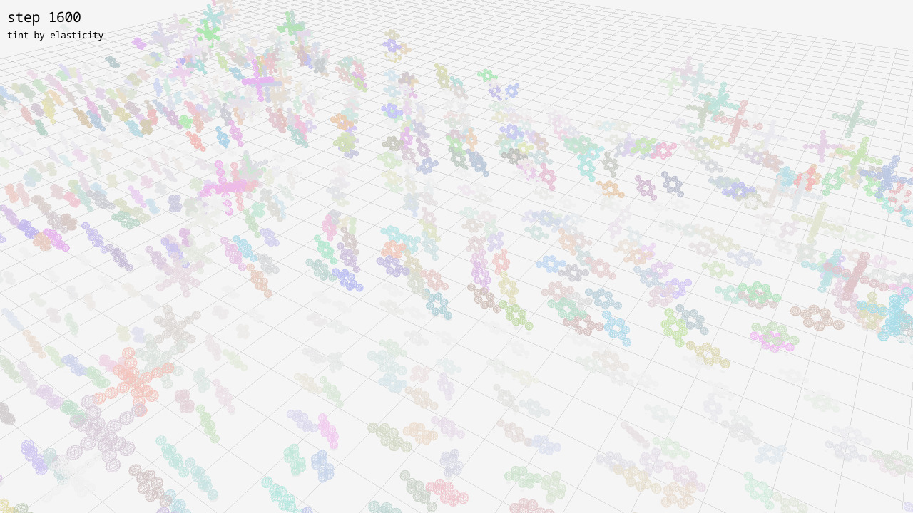

Collection of lab projects done for courses given at Tsinghua University School of Software.

## polygon\_intersect

Polygon intersection by Weiler–Atherton algorithm implemented in Rust.

Try in browser:
[en](https://kawa-yoiko.github.io/graphics-lab-THSS/en/),
[zh](https://kawa-yoiko.github.io/graphics-lab-THSS/zh/).

## rabbit\_hole

A crude local illumination and PBR/IBL renderer.

And a path tracer in Rust.

## particles

Parallelized collision detection on the GPU with a rigid body physics simulator.
Implemented in [Taichi](https://taichi.graphics/) and visualized with [raylib](https://www.raylib.com/).

