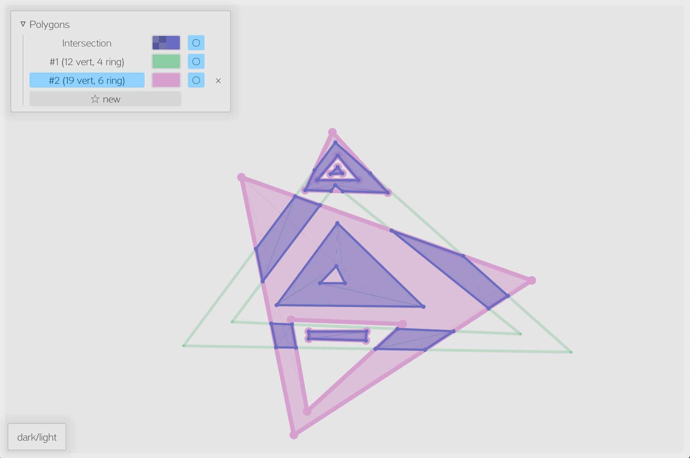

# Polygon Intersection

Polygon intersection visualization in Rust.

Web demo: [**en**](https://kawa-yoiko.github.io/polygon-intersection/en/), [**zh**](https://kawa-yoiko.github.io/polygon-intersection/zh/)




## Building

Make sure to clone the submodule and apply the patch to `egui`.

```sh
git clone --recursive https://github.com/kawa-yoiko/polygon-intersection.git
cd polygon-intersection
git -C egui apply egui.diff
```

### For desktop

`cargo build`.

To build with persistance enabled: `cargo build --features persistence`.

### For web

Requires the WASM target to be installed.

```
rustup target add wasm32-unknown-unknown
cargo install -f wasm-bindgen-cli
cargo update -p wasm-bindgen
```

To build: `sh build_wasm.sh`.

## Licence

Public domain.
