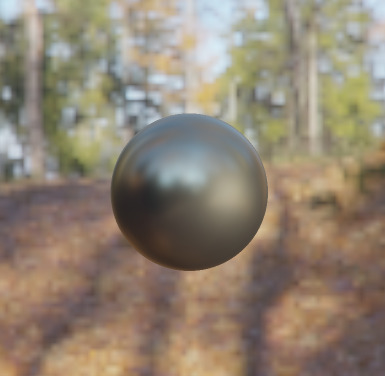
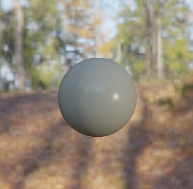

# Physically Based Rendering and Ray Tracer

## PBR




## Path tracer


## Notes

[Squirrel model](https://free3d.com/3d-model/squirrel-v2--389774.html)
by **printable_models** on Free3D.

Environment map from [NoEmotion HDRs](http://noemotionhdrs.net/hdrother.html).
Preprocess with [cmft](https://github.com/dariomanesku/cmft).

Generate skybox:
```sh
cmft \
  --input 11-13_Forest_D_scaled.hdr \
  --outputNum 1 \
  --output0 skybox \
  --output0params hdr,rgbe,facelist
```

Generate irradiance map:
```sh
cmft \
  --input 11-13_Forest_D_scaled.hdr \
  --filter irradiance \
  --outputNum 1 \
  --output0 irrad \
  --output0params hdr,rgbe,facelist
```

Generate radiance map:
```sh
cmft \
  --input 11-13_Forest_D_scaled.hdr \
  --filter radiance \
  --srcFaceSize 256 \
  --excludeBase false \
  --mipCount 6 \
  --glossScale 10 \
  --glossBias 1 \
  --lightingModel phongbrdf \
  --dstFaceSize 256 \
  --numCpuProcessingThreads 4 \
  --useOpenCL true \
  --clVendor anyGpuVendor \
  --deviceType gpu \
  --deviceIndex 0 \
  --inputGammaNumerator 1.0 \
  --inputGammaDenominator 1.0 \
  --outputGammaNumerator 1.0 \
  --outputGammaDenominator 1.0 \
  --generateMipChain false \
  --outputNum 2 \
  --output0 rad \
  --output0params hdr,rgbe,facelist
```
